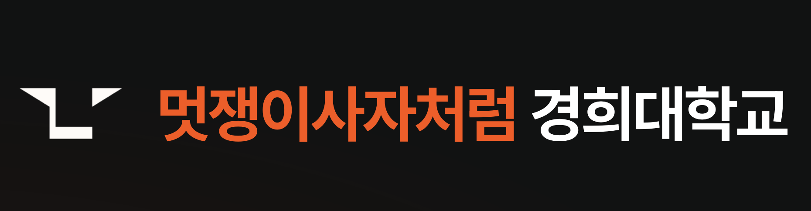

<div align="center">

<br/>



<br/>
<br/>

**동아리의 얼굴을 만듭니다.**
한 기수가 쓰고 버리는 사이트가 아니라, 계속 쌓아 올릴 자산을.


<sub>세상이 AI로 다시 쓰이는 지금, 우리가 배우고 만드는 방식도 다시 씁니다.</sub>

<br/>

[](https://likelion-khu.com)

<br/>

</div>

---

> **📖 이 사이트를 만든 과정 → [경희대 멋사의 공식 얼굴을 만드는 과정](https://likelion-khu.com/blog/39c765cfdf80)**
> 무엇을, 왜, 어떻게 만들었는지 — 8명이 직접 기록했습니다.

---

## 우리가 보는 것

동아리의 활동은 매 기수 반복됩니다. 하지만 결과물은 흩어지고 사라집니다.
인스타에, 노션에, 개인 폴더에. 검색도 안 되고, 다음 기수로 이어지지도 않습니다.

**우리는 이걸 자산의 문제로 봅니다.** 그래서 세 가지를 목표로 합니다.

<br/>

<table>
<tr>
<td width="33%" valign="top">

### 01 · 얼굴
누가 와도 5초 만에
"이런 곳이구나"가
전해진다.

</td>
<td width="33%" valign="top">

### 02 · 연결
지금의 관심이
휘발되지 않고
다음 모집으로 이어진다.

</td>
<td width="33%" valign="top">

### 03 · 축적
프로젝트 · 사람 · 글이
기수를 넘어
계속 쌓인다.

</td>
</tr>
</table>

---

## 팀

| 역할 | 멤버 |
| :-- | :-- |
| **PM** | 김우진 |
| **디자인** | 김영웅 · 유한솔 |
| **프론트엔드** | 박일하 · 김현정 |
| **백엔드** | 신선우 · 안시현 |
| **인프라** | 장찬욱 |

8명이 AI와 함께, 훨씬 큰 팀의 속도로 만듭니다.

---

## 아키텍처

<div align="center">


</div>

<br/>

모노레포 하나에 전부 들어 있습니다.

```
frontend/    화면            Next.js
backend/     API · 데이터     Spring Boot · SQLite
infra/       배포 · 운영      OCI · Docker · nginx
shared/      API 계약         프론트 ↔ 백엔드 단일 진실
pm/          기획 · 운영
```

<br/>

<div align="center">

<sub>[조직 프로필](https://github.com/likelion-khu-official) · [Blog](https://likelion-khu.com/blog) · [Instagram](https://www.instagram.com/likelion_khu/) · [likelion-khu.com](https://likelion-khu.com)</sub>

<br/>

<sub>© 멋쟁이사자처럼 경희대 · Built to last, not to reset.</sub>

</div>
