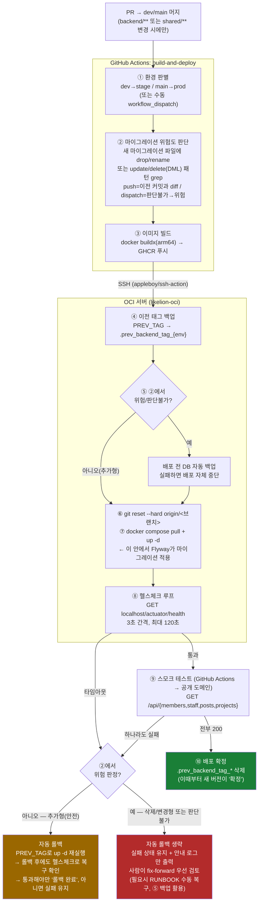

# CI/CD 절차 — `.github/workflows/ci.yml` · `cd.yml`

> 인프라 문서. 아래는 `cd.yml` 실제 스텝을 그대로 옮긴 것 — 코드가 바뀌면 이 다이어그램도 같이 갱신한다.

## 배포 파이프라인 (CD)

PR이 `dev`/`main`에 머지되면(`backend/**` 또는 `shared/**` 변경 시에만 트리거) 아래 파이프라인이 돈다. 박스 왼쪽 열은 GitHub Actions 러너, 오른쪽 열은 OCI 서버(SSH)에서 실행되는 구간이다.

**읽는 법 — 왜 순서가 이렇게 고정돼 있나**:
- **②(마이그레이션 위험도 판단)이 이후 ⑤(사전 백업)·롤백 분기 전부를 결정한다(#320, 2026-07-31 이슈).** 이번 배포로 새로 추가된 마이그레이션이 컬럼 삭제·이름변경형이면, 구버전 앱으로 자동 롤백해도 그 컬럼을 찾다가 새로운 장애를 만들 수 있다 — 그래서 이 경우만 자동 개입을 멈추고 사람에게 넘긴다. 판정은 이 프로젝트가 SQLite 제약 때문에 삭제·이름변경에 항상 쓰는 "테이블 재생성 패턴"(`db-migration.md`)에 기대는 휴리스틱이라, 이 컨벤션을 벗어난 파괴적 SQL은 못 잡을 수 있다는 한계가 있다.
- **(2026-07-31 실측 보강) DROP/RENAME 키워드만으론 UPDATE/DELETE 같은 순수 DML을 못 잡는다.** 4개 시나리오(추가형/삭제형 × 성공/실패)로 stage 실측 검증하던 중, 실제 마이그레이션 히스토리에 `INSERT OR IGNORE`만 있는 파일(`V20260728115500`)이 이미 있었다는 걸 발견했다 — 그 파일 자체는 멱등해서 무해했지만, 같은 자리에 `UPDATE`/`DELETE`가 있었다면 "안전(추가형)"으로 오분류돼 배포 전 자동 백업도 안 뜨고 자동 롤백만 실행됐을 것이다. DROP/RENAME은 "구버전 앱과의 스키마 호환성" 문제, UPDATE/DELETE는 "롤백해도 이미 사라진 데이터는 안 돌아온다"는 문제로 종류가 다르지만 둘 다 사람이 먼저 봐야 하는 건 같아서, `update <표> set`·`delete from` 패턴도 같은 destructive=true로 묶었다(INSERT는 기존 행을 안 건드리니 계속 안전 취급).
- ④(이전 태그 백업)가 ⑨(스모크 테스트) 실패 시 되돌아갈 대상이다 — ⑩에서 배포가 완전히 확정된 뒤에만 이 마커를 지운다. 헬스체크(⑧) 직후에 지우면 스모크 테스트(⑨)가 실패해도 롤백 스텝이 "마커가 없다"며 그냥 건너뛰어버리는 사고가 실제로 있었다(#133 dev→main 승격 중 prod 실측) — 그래서 지우는 시점을 스모크 테스트 뒤로 미뤘다.
- ⑧(헬스체크)은 컨테이너 안에서 `localhost`로 확인 — "앱이 떴다"만 보장한다. ⑨(스모크 테스트)은 일부러 GitHub Actions에서 실제 공개 도메인으로 다시 찌른다 — DNS·TLS·nginx 라우팅까지 포함해 실제 사용자가 겪는 경로 그대로 검증하기 위해서다. 이 둘은 같은 걸 두 번 확인하는 게 아니라 서로 다른 계층을 본다.
- `infra/**`만 바뀐 커밋은 이 파이프라인이 아예 안 돈다(트리거 조건이 `backend/**`·`shared/**`뿐) — 그럴 땐 수동 배포가 필요하다. 절차는 [`RUNBOOK.md`](./RUNBOOK.md#cheat-sheet) "자주 쓰는 명령" 참고.

## PR 단계 (CI)

`ci.yml`은 PR이 열릴 때 백엔드 테스트를 돌리고 결과를 PR 코멘트로 남긴다 — 배포는 하지 않는다(그건 머지 이후 CD의 몫). dev/main 어느 쪽으로 가는 PR이든 동일하게 실행된다.
