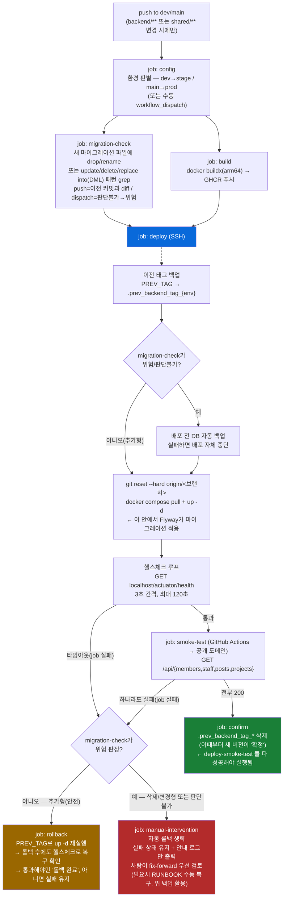

# CI/CD 절차 — `.github/workflows/ci.yml` · `cd.yml`

> 인프라 문서. 아래는 `cd.yml` 실제 job·스텝을 그대로 옮긴 것 — 코드가 바뀌면 이 다이어그램도 같이 갱신한다.

## 배포 파이프라인 (CD)

PR이 `dev`/`main`에 머지되면(`backend/**` 또는 `shared/**` 변경 시에만 트리거) 아래 파이프라인이 돈다. `ci.yml`처럼 job이 여러 개로 나뉘어 있어서(2026-07-31, #320 후속) GitHub Actions 화면에서 이 그림 그대로 블록이 보인다 — job 이름은 각 박스 위에 적힌 그대로다. 회색 박스는 GitHub Actions 러너, 파란 박스는 OCI 서버(SSH)에서 실행된다.

`deploy` job의 실제 스텝은 SSH 하나(`OCI 배포 및 헬스체크`)뿐이고, 위 그림의 "이전 태그 백업"부터 "헬스체크 루프"까지는 그 스텝 하나 안에서 순서대로 실행되는 스크립트 내용이다 — job 경계와는 다른 층이라 점선으로 구분했다.

**job 간 상태는 두 가지 방법으로만 전달된다** — job마다 완전히 새 러너(빈 워크스페이스)에서 시작하므로 파일이나 셸 변수를 그대로 물려받지 못한다.
- `outputs`(문자열): `config` job이 `env`/`tag_prefix`/`service`/`port`, `migration-check` job이 `destructive`를 내보내고, 뒤 job들이 `needs.<job>.outputs.<이름>`으로 읽는다.
- OCI 서버 파일: `deploy` job이 SSH로 `.prev_backend_tag_{env}` 파일에 이전 태그를 써두면, `confirm`·`rollback` job이 각자 다시 SSH로 그 파일을 읽는다 — 서버 쪽에 남는 상태라 GitHub Actions job이 갈려도 그대로 전달된다.

**읽는 법 — 왜 순서가 이렇게 고정돼 있나**:
- **`migration-check`가 이후 `deploy`의 사전 백업·`rollback`/`manual-intervention` 분기 전부를 결정한다(#320, 2026-07-31 이슈).** 이번 배포로 새로 추가된 마이그레이션이 컬럼 삭제·이름변경형이면, 구버전 앱으로 자동 롤백해도 그 컬럼을 찾다가 새로운 장애를 만들 수 있다 — 그래서 이 경우만 자동 개입을 멈추고 사람에게 넘긴다. 판정은 이 프로젝트가 SQLite 제약 때문에 삭제·이름변경에 항상 쓰는 "테이블 재생성 패턴"(`db-migration.md`)에 기대는 휴리스틱이라, 이 컨벤션을 벗어난 파괴적 SQL은 못 잡을 수 있다는 한계가 있다.
- **(2026-07-31 실측 보강) DROP/RENAME 키워드만으론 UPDATE/DELETE 같은 순수 DML을 못 잡는다.** 4개 시나리오(추가형/삭제형 × 성공/실패)로 stage 실측 검증하던 중, 실제 마이그레이션 히스토리에 `INSERT OR IGNORE`만 있는 파일(`V20260728115500`)이 이미 있었다는 걸 발견했다 — 그 파일 자체는 멱등해서 무해했지만, 같은 자리에 `UPDATE`/`DELETE`가 있었다면 "안전(추가형)"으로 오분류돼 배포 전 자동 백업도 안 뜨고 자동 롤백만 실행됐을 것이다. DROP/RENAME은 "구버전 앱과의 스키마 호환성" 문제, UPDATE/DELETE는 "롤백해도 이미 사라진 데이터는 안 돌아온다"는 문제로 종류가 다르지만 둘 다 사람이 먼저 봐야 하는 건 같아서, `update <표> set`·`delete from` 패턴도 같은 destructive=true로 묶었다(INSERT는 기존 행을 안 건드리니 계속 안전 취급).
- **같은 보강 직후 한 겹 더 — `INSERT OR REPLACE`/`REPLACE INTO`는 이름은 INSERT지만 PK/UNIQUE 충돌 시 기존 행을 지우고 새로 넣는 사실상 DELETE+INSERT다.** "INSERT는 전부 안전"이라고 단순화하면 이 패턴을 놓친다 — `or replace`·`replace into`도 같은 destructive 취급에 추가했다(`INSERT OR IGNORE`는 충돌 시 그냥 건너뛰어 기존 행을 안 건드리므로 계속 안전).
- `deploy`가 써두는 이전 태그 백업이 `smoke-test` 실패 시 되돌아갈 대상이다 — `confirm`이 실행돼 배포가 완전히 확정된 뒤에만 이 마커를 지운다. `deploy`의 헬스체크 직후에 지우면(예전 방식) 그 다음 `smoke-test`가 실패해도 `rollback`이 "마커가 없다"며 그냥 건너뛰어버리는 사고가 실제로 있었다(#133 dev→main 승격 중 prod 실측) — 그래서 지우는 시점을 `smoke-test` 뒤(`confirm` job)로 미뤘다. `confirm`은 `deploy`·`smoke-test`가 둘 다 성공해야만 GitHub Actions가 자동으로 실행해준다(`needs`의 기본 동작) — 그래서 둘 중 하나라도 실패하면 `confirm`은 저절로 스킵되고 마커가 살아남는다.
- `deploy`의 헬스체크는 컨테이너 안에서 `localhost`로 확인 — "앱이 떴다"만 보장한다. `smoke-test`는 일부러 GitHub Actions에서 실제 공개 도메인으로 다시 찌른다 — DNS·TLS·nginx 라우팅까지 포함해 실제 사용자가 겪는 경로 그대로 검증하기 위해서다. 이 둘은 같은 걸 두 번 확인하는 게 아니라 서로 다른 계층을 본다.
- **`rollback`·`manual-intervention` job은 `if: always() && ...`가 붙어 있다.** GitHub Actions는 기본적으로 `needs`로 지정한 job이 실패하면 그 뒤 job을 자동으로 skip한다 — `always()`가 없으면 `deploy`가 실패했을 때 `rollback`·`manual-intervention` 자신도 그냥 skip돼버려서 실패를 감지할 기회 자체가 없다. `always()`로 그 기본 skip을 뚫은 다음, `if` 안에서 `needs.deploy.result`/`needs.smoke-test.result`를 직접 확인해 "진짜 실패했을 때만" 실행되게 한다.
- `infra/**`만 바뀐 커밋은 이 파이프라인이 아예 안 돈다(트리거 조건이 `backend/**`·`shared/**`뿐) — 그럴 땐 수동 배포가 필요하다. 절차는 [`RUNBOOK.md`](./RUNBOOK.md#cheat-sheet) "자주 쓰는 명령" 참고.

## 실측 검증 이력

이 파이프라인의 위험도 판단·롤백·안전장치는 전부 코드 리뷰만으로 끝내지 않고 실제 stage 배포로 재현·검증했다 — 결과만 요약, 경위는 각 커밋·`pm/docs/learnings.md`.

**#320 조건부 롤백 로직 (2026-07-31)** — 추가형/삭제형 × 성공/실패 4가지 + 사각지대 보강 2가지, 총 6개 시나리오를 실제 stage에 순차 배포해 확인:

| 시나리오 | 마이그레이션 | 배포 결과 | 확인된 동작 |
|---|---|---|---|
| A | 추가형(안전) | 강제 실패 | 자동 롤백 실행 → 롤백 후 헬스체크로 복구까지 확인(원래 사고 재현) |
| B | 삭제/변경형(위험) | 강제 실패 | 자동 롤백 생략, 배포 전 백업만 실행, 실패 상태 유지 |
| C | 추가형(안전) | 정상 성공 | 위험도 판단 스텝이 정상 배포에 부작용 없음 |
| D | 삭제/변경형(위험) | 정상 성공 | 배포 전 자동 백업이 정상 배포를 막지 않음 |
| E | DML(UPDATE)만, DROP/RENAME 키워드 없음 | 강제 실패 | `destructive=true`로 정확히 잡힘(사각지대 보강 검증) |
| F | `INSERT OR REPLACE`만 | 강제 실패 | `destructive=true`로 정확히 잡힘(사각지대 보강 검증) |

같은 날 `cd.yml`을 단일 job에서 8개 job(위 다이어그램 구조)으로 리팩터링한 뒤, **성공 경로 / `rollback` 경로 / `manual-intervention` 경로 3가지를 다시 실제 배포로 재검증**해 job 분리가 기존 동작을 그대로 보존하는지 확인했다.

**stage DB 전체삭제 사고 재발 방지 (2026-08-01)** — `FlywayConfig`의 `clean()`→`repair()` 교체 + `migration-check`의 "이미 배포된 마이그레이션 파일 삭제·수정 감지" 가드를 추가한 뒤, 다음 순서로 검증:

1. **실제 fix를 `dev`에 배포** — 마이그레이션 파일 자체는 안 건드린 변경이라 `판단 결과: false`로 정상 통과, 헬스체크·스모크테스트·확정까지 정상 완료 확인.
2. **가드 로직 자체는 `dev` push 없이 검증** — `dev`/`main`에 실제로 push해서 CD를 돌리는 건 공유 인프라(실제 stage 재배포)를 건드리는 액션이라, 대신 `migration-check` 스텝의 `run:` 블록을 `sed`로 원본 그대로 추출하고 `${{ github.xxx }}` 표현식만 쉘 변수로 바꿔 로컬의 실제 `origin/dev` 히스토리 위 임시 브랜치에 대고 그대로 실행했다(로직을 다시 옮겨 적지 않고 원본 문자열을 그대로 돌렸다는 게 핵심 — "내가 이해한 로직"이 아니라 "GitHub Actions가 실제로 실행할 그 스크립트"를 검증):

| 시나리오 | 조작 | REMOVED | MODIFIED | 결과 |
|---|---|---|---|---|
| 삭제 | 이미 배포된 마이그레이션 파일을 지움(이번 사고 재현) | 잡힘 | — | `exit 1`, 배포 차단 |
| 변경 | 이미 배포된 마이그레이션 파일의 SQL 내용만 고침(체크섬 불일치 재현) | — | 잡힘 | `exit 1`, 배포 차단 |
| 정상 흐름 | 신규 마이그레이션만 추가, 기존 파일 안 건드림 | — | — | `판단 결과: false`, 정상 통과(false positive 없음) |

검증용 로컬 브랜치는 확인 즉시 삭제, `dev`엔 아무 것도 추가로 push하지 않았다.

## PR 단계 (CI)

`ci.yml`은 PR이 열릴 때 백엔드 테스트를 돌리고 결과를 PR 코멘트로 남긴다 — 배포는 하지 않는다(그건 머지 이후 CD의 몫). dev/main 어느 쪽으로 가는 PR이든 동일하게 실행된다.
