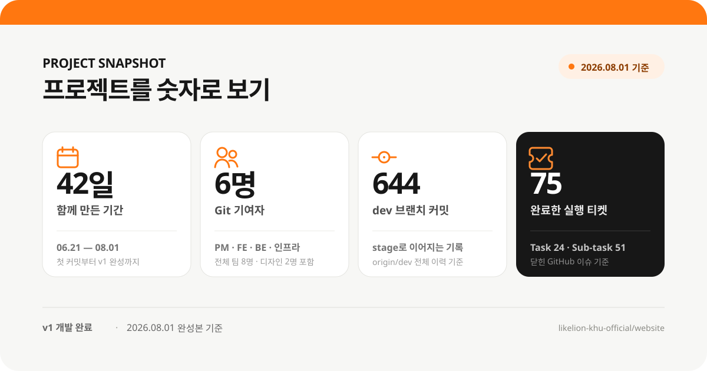
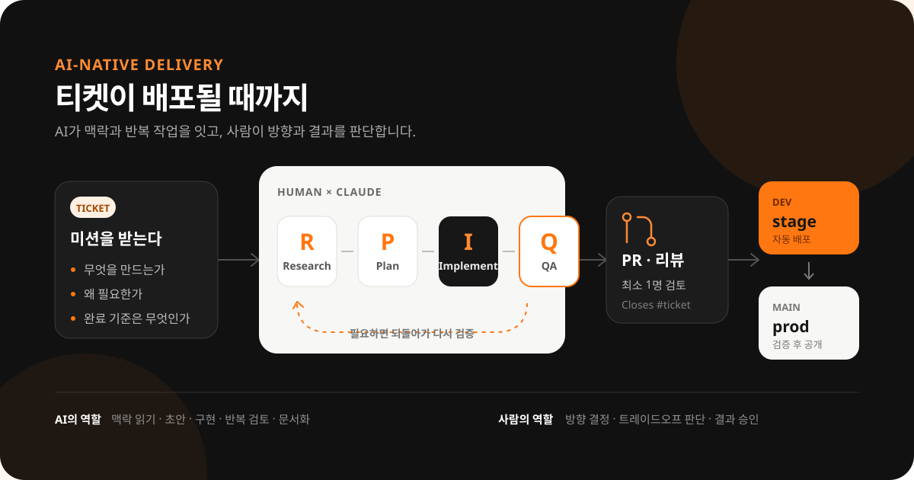

# 경희대 멋사의 공식적인 얼굴을 만드는 과정

> 글의 핵심 문장: 우리는 홍보 채널을 하나 더 만든 것이 아니라, 경희대 멋사를 설명하고 기록하며 다음 기수가 이어갈 수 있는 공식 거점을 만들었다.

## 편집 방향

- 결과 자랑보다 **왜 필요했고, 어떤 구조로 만들었으며, 무엇을 남겼는지**를 보여준다.
- 긴 설명 대신 `SVG 2장 + 저장소 tree + 팀원 카드 + KPI 표`를 중심으로 읽게 한다.
- 숫자는 규모를 과장하는 성과가 아니라, 뒤에 나오는 작업 방식의 밀도를 이해시키는 배경으로 쓴다.
- “AI를 썼다”가 아니라 **AI가 읽고 실행할 수 있도록 일과 저장소를 설계했다**는 점을 차별점으로 삼는다.

---

## 1. 인스타그램이 있는데, 왜 홈페이지를 만들었을까

### 이 절의 한 문장

인스타그램은 활동의 순간을 보여주지만, 홈페이지는 우리가 누구인지 한 번에 설명하고 시간이 지나도 기록을 축적하는 공식 거점이 된다.

### 본문 뼈대

- 이전에는 소개·활동·프로젝트·사람에 관한 정보가 인스타그램과 노션 등에 흩어져 있었다.
- 처음 접한 사람은 게시물을 시간순으로 뒤져야 했고, 동아리의 전체 모습과 방향을 한 번에 파악하기 어려웠다.
- 그래서 새 홍보 채널을 늘리기보다, 다른 채널의 정보가 돌아와 쌓이는 **공식 기준점**을 만들기로 했다.
- 특히 코딩을 시작하고 싶지만 어디서 시작해야 할지 막막한 경희대생이 5초 안에 “이곳은 실제로 함께 만들며 배우는 동아리”라고 이해하는 것을 첫 장면의 기준으로 삼았다.

### 시각자료 제안

`인스타그램 = 시간순으로 흘러가는 점들`과 `홈페이지 = 소개·활동·사람·프로젝트가 모이는 하나의 허브`를 좌우로 비교한 작은 SVG. 글로 설명할 때보다 “채널 추가가 아니라 기준점”이라는 차이가 즉시 보인다.

---

## 2. 우리가 만들고 싶었던 공식적인 얼굴

### 목표

경희대 멋사를 처음 접하는 외부인이 동아리의 정체성, 활동, 사람, 분위기를 부족함 없이 이해할 수 있고, 관심이 생기면 지원 또는 모집 알림 신청으로 이어질 수 있는 공식 홈페이지를 만든다.

### v1에 반드시 담은 것

- 소개: 동아리의 방향과 세션, 연간 활동
- 프로젝트: 결과물의 목록과 상세 기록
- 사람: 멤버 로스터와 운영진 소개
- 기록: 멤버가 직접 쌓는 블로그
- 모집: 자체 지원폼과 모집 알림 신청
- 운영: 멤버·관리자가 콘텐츠와 계정을 직접 관리하는 화면

### 전달하고 싶었던 인상

- 단순히 코딩을 공부하는 모임이 아니라 **사람이 함께 실제 결과물을 만드는 곳**
- 결과만 전시하는 조직이 아니라 **배운 것과 과정을 축적하는 곳**
- 한 번 만들고 버리는 페이지가 아니라 **다음 기수가 이어서 운영할 수 있는 공식 자산**

### 이번 버전에서 의도적으로 다루지 않은 것

- 범용 동아리 플랫폼이나 외부 조직을 위한 SaaS
- 작은 조직에 과한 승인 절차와 세분화된 권한 체계
- 검색·신고·반복 위반 제재 등 실제 필요가 확인되지 않은 고도화 기능
- 1년에 몇 번뿐인 운영을 위한 과도한 자동화

### 우리가 생각한 ‘외부에 내놓을 수 있는 수준’

기능이 한 번 동작하는 상태가 아니라, 공개 정보의 정확성·모바일과 데스크톱의 사용성·콘텐츠 운영 경로·오류 감지와 복구까지 준비되어 외부인에게 공식 링크 하나를 그대로 전달할 수 있는 상태다.

---

## 3. 프로젝트를 숫자로 보기



### 본문 초안

6월 21일부터 8월 1일까지 42일 동안, GitHub에서 작업한 6명이 `dev` 브랜치에 644개의 커밋을 쌓고 75개의 실행 티켓을 완료했다. 디자인 두 명까지 포함하면 프로젝트 전체 팀은 8명이다. 이 숫자는 생산성을 과장하기 위한 지표가 아니라, 짧은 기간 동안 작은 팀이 어떤 운영 구조로 복잡한 제품을 완성했는지 이해하기 위한 배경이다.

> 집계 기준: `origin/dev` 전체 이력, Git 기여자 6명, GitHub 네이티브 타입 `Task` 24개와 `Sub-task` 51개 중 `COMPLETED`로 닫힌 이슈. 같은 시점에 완료 처리된 전체 GitHub 이슈는 123개이고, `dev`로 머지된 PR은 133개다.

---

## 4. 우리는 어떻게 일했는가



### 4-1. AI를 도구가 아니라 작업 환경으로 두었다

- 모든 팀원이 같은 모노레포에서 일하고, 역할별 `CLAUDE.md`가 프로젝트 맥락과 규칙을 전달한다.
- 티켓에는 무엇을 만드는지, 왜 필요한지, 어디까지 되면 끝인지가 담긴다.
- Claude는 티켓과 저장소를 함께 읽고 `Research → Plan → Implementation → QA` 순환을 수행한다.
- 사람은 방향, 설계의 트레이드오프, 결과 승인처럼 학습과 책임이 남아야 하는 판단을 맡는다.

### 4-2. 저장소 자체를 AI가 읽을 수 있는 운영체제로 만들었다

```text
website/
├── frontend/                 # 공개·멤버·관리자 화면
│   ├── e2e/                  # 브라우저 사용자 흐름 검증
│   ├── public/               # 정적 이미지
│   └── src/                  # Next.js 애플리케이션
├── backend/
│   ├── docs/                 # 백엔드 운영 지식
│   └── src/                  # Spring API·도메인·테스트
├── infra/
│   ├── docs/                 # 운영·인수인계 런북
│   └── scripts/              # 배포·백업·관측 자동화
├── shared/
│   └── types/                # FE↔BE API 계약의 단일 원본
└── pm/
    ├── docs/                 # 프로젝트 정의와 learnings
    ├── missions/             # 제안·진행·결과가 담긴 미션 상자
    ├── qa/
    │   ├── criteria/         # Given–When–Then 성공 기준
    │   └── verification/     # 실제 pass/fail과 근거
    ├── onboarding/           # 팀원이 첫날 읽는 작업 방식
    └── scripts/              # 이슈·보드 운영 자동화
```

이 구조의 핵심은 문서를 많이 만든 것이 아니다. 코드는 포지션 디렉터리, FE↔BE 계약은 `shared`, 제품 정의와 배운 것은 `pm`, 실시간 진행은 GitHub에 두어 정보가 복제되어 어긋나는 일을 줄였다. AI도 사람이 찾는 것과 같은 단일 원본을 읽기 때문에, 매 세션을 처음부터 다시 설명할 필요가 없다.

### 4-3. 모든 일을 티켓 단위로 만들었다

- 제품은 `Epic → Story → Sub-task` 계층으로 나누고, 순수 기술 작업은 `Task`로 관리했다.
- 개발자가 실제로 받는 티켓은 얇은 할 일 목록이 아니라 자신의 **왜와 완료 기준**을 가진 미션이었다.
- 담당자, 범위, 완료 조건, 상위 사용자 기능이 연결되어 병목과 남은 일을 팀 전체가 함께 볼 수 있었다.
- 브랜치에서 작업한 결과는 PR과 최소 1명의 리뷰를 거쳐 `dev`에 합쳐졌고, `dev`는 stage에 자동 배포되었다. 검증을 마친 결과는 `main`을 통해 production으로 공개했다.

### 4-4. 포지션은 중심 역할이지 경계가 아니었다

- FE와 BE는 문서가 아니라 `shared/types`의 실제 타입을 계약으로 공유했다.
- 인프라는 배포 이후에 붙는 팀이 아니라 초기부터 서버·비용·배포·복구 조건을 함께 설계했다.
- PM과 개발자는 구현 가능성, 사용자 경험, 콘텐츠 의도를 이슈와 PR에서 함께 조정했다.
- 자신의 주 역할 밖이라도 사용자 흐름을 완성하는 데 필요한 문제는 직접 연결해 해결했다.

### 4-5. ‘구현 완료’와 ‘공개 가능’을 구분했다

- 성공 기준은 `pm/qa/criteria`에 Given–When–Then으로 정의했다.
- 실제 검증 결과는 `pm/qa/verification`의 33개 문서에 근거와 함께 분리해 기록했다.
- 프론트에는 단위·통합 테스트와 Playwright E2E 환경을 두었다.
- 배포 뒤에는 헬스체크와 스모크 테스트, 모니터링과 알람, DB 백업과 롤백 경로를 함께 검증했다.
- 디자인 QA는 기능 pass/fail과 별도로 관리해 “코드가 동작한다”가 곧 “외부에 보여도 된다”로 오인되지 않게 했다.

> 여기에 실제 QA 대시보드 또는 검수 화면 캡처를 배치한다. 캡션은 “어떤 화면이 검토됐고 무엇이 남았는지 팀 전체가 같은 기준으로 봤다.” 정도로 짧게 둔다.

---

## 5. 역할보다, 해결한 문제로 소개하는 사람들

### 추천 소제목

**각자의 자리는 달랐지만, 해결한 문제는 하나의 사용자 경험으로 이어졌다.**

| 만든이 | 중심 역할 | 맡아 해결한 핵심 문제 |
|---|---|---|
| 김우진 | PM·제품 통합 | 프로젝트의 목표와 범위를 정하고, 티켓·미션·QA·learnings가 이어지는 AI-native 운영 구조를 만들었다. 막판에는 공개 화면·멤버 영역·어드민을 가로지르는 통합과 완성도 보강도 맡았다. |
| 박일하 | 프론트엔드 | 프론트 기술 기반을 세우고 랜딩 전체, 블로그·모집 알림·지원폼·관리 화면을 실제 사용 가능한 화면으로 연결했다. 스크롤 탐색과 디자인 QA도 다듬었다. |
| 김현정 | 프론트엔드 | 메인 랜딩과 블로그, 멤버·관리자 로그인처럼 사용자가 처음 만나는 진입 흐름을 구현했다. Vitest·RTL·Playwright 테스트 환경을 세워 화면 품질을 반복 검증할 기반도 만들었다. |
| 신선우 | 백엔드 | Spring 기반을 세우고 블로그, 관리자 인증, 멤버·운영진 데이터처럼 서비스의 핵심 도메인과 API 골격을 만들었다. |
| 안시현 | 백엔드 | 모집 알림, 블로그 CRUD, 멤버·프로젝트 API와 역할 체계를 구현해 공개 화면과 멤버 작업 화면에 필요한 데이터를 연결했다. |
| 장찬욱 | 인프라·백엔드 | CI/CD와 stage·production 환경, 이미지 저장소, 이메일, 모니터링·백업·복구를 구축했다. Flyway와 마이그레이션 가드, 인증·관리 기능 보강까지 맡아 서비스가 계속 운영될 수 있는 기반을 만들었다. |

> 디자인팀 김영웅·유한솔은 IA·와이어프레임·시각 시안으로 사이트의 구조와 인상을 만들었다. 숫자 SVG의 “Git 기여자 6명”과 프로젝트 전체 “8명”을 구분해, GitHub 기록이 적다는 이유로 디자인 기여가 사라지지 않게 소개한다.

### 카드형으로 바꿀 때의 형식

`이름 / 중심 역할 / 해결한 문제 한 문장 / 대표 산출물 2개`만 둔다. 커밋 수를 개인 성과로 나열하면 통합·리뷰·디자인처럼 숫자로 잡히지 않는 기여를 왜곡하므로 넣지 않는다.

---

## 6. 목표에 얼마나 도달했는가

처음 세운 목표는 “외부인이 경희대 멋사의 정체성, 활동, 사람, 분위기를 부족함 없이 이해할 수 있는 공식 홈페이지”였다. 완성본을 이 문장에 다시 대입해 평가했다.

| 목표 판단 기준 | 결과 | 근거 |
|---|---|---|
| 동아리의 정체성이 드러나는가 | **달성** | 히어로에서 소개·세션·연간 활동·프로젝트·사람·블로그·모집으로 이어지는 한 흐름을 만들었다. |
| 활동과 사람을 충분히 보여주는가 | **달성** | 프로젝트 목록·상세, 멤버 로스터, 운영진 소개, 활동 페이지와 블로그를 실제 데이터로 연결했다. |
| 공식 정보의 기준점이 되었는가 | **달성** | 흩어져 있던 핵심 정보를 하나의 정보 구조와 공식 링크로 모았고, 관리자가 직접 갱신할 수 있게 했다. |
| 외부에 공개할 완성도에 도달했는가 | **달성** | 반응형 화면, 기능·E2E·디자인 QA, 배포 후 스모크 테스트와 모니터링·백업·복구 경로까지 함께 마련했다. |
| 모집 과정에 실제 도움이 되는가 | **향후 검증 필요** | 지원폼과 모집 알림 경로는 완성했지만, 실제 지원자의 유입 경로와 전환은 다음 모집 기간 데이터로 확인해야 한다. |
| 기록이 지속적으로 축적되는가 | **부분 달성** | 멤버가 글·프로젝트·프로필을 직접 갱신할 구조는 완성했다. 다음 기수에서도 실제로 운영되는지는 시간으로 검증해야 한다. |

### 이 표 아래에서 짚을 점

완성도는 기능 수나 커밋 수로 판정하지 않았다. 방문자가 동아리를 이해하는 흐름, 멤버가 자신의 기록을 쌓는 흐름, 관리자가 공식 정보를 유지하는 흐름, 운영자가 장애를 발견하고 복구하는 흐름이 각각 끝까지 이어지는지를 기준으로 삼았다.

---

## 7. 이 홈페이지가 앞으로 남길 가치

### 지금 남긴 것

- 경희대 멋사를 대표해 바로 전달할 수 있는 공식 링크
- 소개·활동·프로젝트·사람·모집 정보를 한곳에서 이해하는 구조
- 외부인이 동아리의 결과와 과정을 함께 보는 기본 맥락
- 멤버와 관리자가 한 사람에게 의존하지 않고 콘텐츠를 갱신하는 운영 화면
- 다음 운영진이 코드뿐 아니라 이유·검증·운영 방법까지 이어받는 기반

### 시간이 지나며 커질 것

- 기수별 활동과 프로젝트의 축적
- 구성원과 팀이 무엇을 만들고 배웠는지 보여주는 역사
- 모집과 외부 협업에서 활용할 수 있는 신뢰 자산
- 매번 처음부터 소개 자료를 만들지 않아도 되는 공통 기반
- 다음 기수가 이전 시행착오 위에서 더 나은 결정을 내릴 수 있게 하는 learnings

### 연결 문장

웹사이트의 가장 큰 가치는 공개한 첫날보다, 새로운 사람과 활동이 쌓이는 두 번째·세 번째 해에 더 선명해진다.

---

## 8. 공식적인 얼굴을 계속 유지하는 방법

### 운영 원칙

- 멤버는 자기 프로필·글·프로젝트를 직접 갱신한다.
- 관리자는 멤버·운영진 정보, 모집 상태, 지원자와 구독자 명단, 공개 콘텐츠의 문제 상황을 관리한다.
- 활동계획·통계·지원폼 질문처럼 1년에 한 번 바뀌는 정적 정보는 개발 세션이 Claude와 함께 갱신한다.
- 모집 전에는 지원 질문·모집 상태·안내 메일을 점검하고, 모집 후에는 개인정보를 정해진 절차로 정리한다.
- 다음 기수에는 관리자 계정, 인프라 계정, 배포·백업·복구 런북과 미해결 항목을 함께 인계한다.

### v2에서 검증하고 개선할 것

- 실제 방문자가 5초 안에 경희대 멋사를 이해하는지 외부 사용자에게 확인
- “사이트 보고 지원했다”는 비율과 모집 알림 전환 측정
- 기수·프로젝트·멤버·활동이 쌓였을 때 필요한 검색과 타임라인
- 실제 운영에서 반복되는 수작업만 선별해 자동화
- 접근성·성능·콘텐츠 신선도를 정기 점검하는 가벼운 운영 루프

### 마지막 문장

홈페이지를 배포한 것으로 경희대 멋사의 공식적인 얼굴이 완성되는 것은 아니다. 새로운 활동과 사람이 계속 쌓이고, 그것이 다시 홈페이지에 기록될 때 이 공간도 경희대 멋사와 함께 성장한다.

---

## 글 전체를 한 줄로 압축하면

**왜 필요했는가 → 무엇을 목표로 했는가 → 얼마나, 어떻게 일했는가 → 목표에 도달했는가 → 앞으로 무엇을 축적할 것인가**

## 공개 전 편집 체크

- 완성본 화면 캡처 3장: 랜딩 전체, 프로젝트·사람, 관리자 또는 QA 화면
- 숫자 집계 기준일을 본문과 SVG에서 동일하게 유지
- 디자인 2명을 포함한 전체 8명과 Git 기여자 6명의 표현을 혼동하지 않기
- 모집 효과는 실제 데이터가 없으면 “향후 검증 필요”로 유지
- 내부 하네스 용어는 첫 등장 때 쉬운 말로 풀어 쓰기
